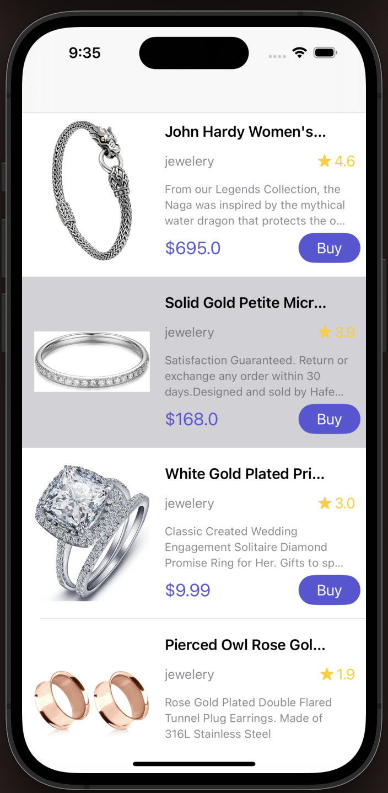
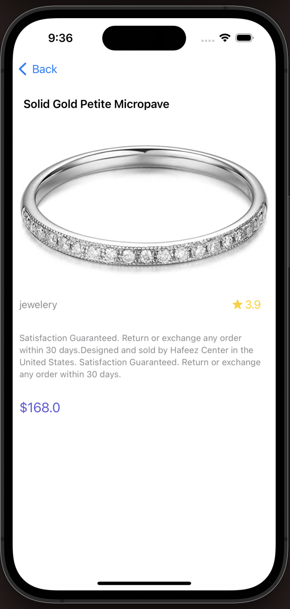

# MVVM (Model View ViewModel) - Singleton - API Calls

Products     |  Product Details
:-------------------------:|:-------------------------:
|

## Characteristics

- [x] UIKit
- [x] MVVM architecture
- [x] Singleton Design Pattern
- [x] URLSession - Generic Api calls - Networking API
- [x] Decodable Protocol with JSONDecoder
- [x] Downloading Image - Kingfisher Library
- [x] Swift Package Manager - SPM
- [x] Closure, Completion, Enum
- [x] Inheritance - Final Keyword, Init()
- [x] Memory Management
